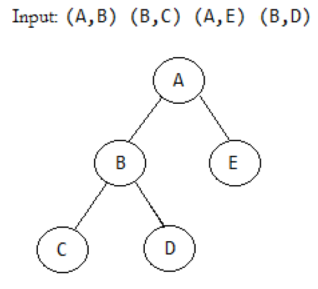

## Software Engineer Interivew @ Optiver, Amsterdam

### Question 1: Shapes
Start out by creating an interface Shape, which has an abstract function GetArea() with integer return value. Then create implementations of this interface for three different shapes: Rectangle, Triangle and Circle. The formulas for calculating the area of each of these shapes are:
* Rectangle: height x width
* Triangle: (height x width) / 2
* Circle: 3.14 x radius x radius

The integer values required to calculate the area for each of these shapes will be provided to the constructor of each shape respectively in the order of appearance in the examples below.

Round the result of the calculation to the nearest integer value before returning it.

#### Examples
* Rectangle(height = 4, width = 3) : GetArea() returns 12
* Triangle(height = 5, width = 2) : GetArea() returns 5
* Circle(radius = 5) : GetArea() returns 79

The total area of these shapes is 96.

#### Solution
[/Optiver/Shapes.cpp](/Optiver/Shapes.cpp)


### Question 2: Royal Names
An ordinal number is a word representing rank or sequential order. The naming convention for royal names is to follow a first name with an ordinal number, which is essentially a Roman numeral used to indicate the birth order of two people having the same name. The Roman numerals from 1 to 50 are defined as follows:

* The respective numerals corresponding to numbers 1 through 10 are I, II, III, IV, V, VI, VII, VIII, IX, and X.
* The respective numerals corresponding to the numbers 20, 30, 40, and 50 are XX, XXX, XL, and L.
* The numeral for any other two-digit number < 50 is constructed by concatenating the numeral(s) for its multiples of ten with the numeral(s) for its values < 10. For example, 47 is 40 + 7 = "XL" + "VII" = "XLVII".

Complete the getSortedList function in your editor. It has 1 parameter: an array of royal name strings, names. Each royal name string consists of a first name, followed by a single space, followed by a Roman numeral. Your function must sort the names lexicographically (alphabetically) by first name; if two or more first names are the same, it must sort those duplicate first names by ascending ordinal number. It must then return the sorted array of royal name strings.

#### Input Format
The locked stub code in your editor reads the following input from stdin and passes it to your function:
The first line contains an integer, n (the number of elements in names). Each line i of the n subsequent lines contains a string describing royal name i (where 0 ≤ i < n) in the names array.

#### Constraints
* 1 ≤ n ≤ 50
* Each names[i] (where 0 ≤ i < n) is a single string composed of 2 space-separated values: firstName and ordinal, respectively. Here, firstName is the first name and ordinal is a valid Roman numeral representing a number between 1 and 50, inclusive.
* 1 ≤ |firstName| ≤ 20
* Each firstName starts with an uppercase letter (A − Z) and its remaining characters are lowercase letters (a − z).
* Each ordinal is a Roman numeral containing the capital letters I, V, X, and/or L.
* The elements in names are pairwise distinct.

#### Output Format
Your function must return a sorted array of royal name strings. This is printed to stdout by the locked stub code in your editor.

##### Sample Input 0
2</br>Louis IX</br>Louis VIII

##### Sample Output 0
Louis VIII</br>Louis IX

##### Sample Input 1
2</br>Philippe I</br>Philip II

##### Sample Output 1
Philip II</br>Philippe I

#### Explanation
Recall that names take precedence over ordinal numbers. This means that the royal names must be sorted lexicographically by name, and then each subset of non-unique names must by sorted by ordinal number.

##### Sample Case 0:
Because both names are the same, we only need to sort by ordinal here. The ordinal number VIII (8) comes before the ordinal number IX (9), so our sorted array must order Louis VIII before Louis IX.

##### Sample Case 1:
When sorted lexicographically, Philip comes before Philippe. Because both names are unique, we do not need to further sort by ordinal. Thus, our sorted array orders Philip II before Philippe I.

#### Solution
[/Optiver/Royal-Names.cpp](/Optiver/Royal-Names.cpp)


### Question 3: The Giving Tree of Errors
You are given a binary tree written as a sequence of parent-child pairs. You need to detect any errors which prevent the sequence from being a proper binary tree and print the highest priority error. If you detect no errors, print out the lexicographically smallest S-expression for the tree.

#### Input Format
Input is read from standard input and has the following characteristics:
* It is one line.
* Leading or trailing whitespace is not allowed.
* Each pair is formatted as an open parenthesis '(', followed by the parent, followed by a comma, followed by the child, followed by a closing parenthesis ')'. Example: (A,B)
* All values are single, uppercase letters.
* Parent-Child pairs are separated by a single space.
* The sequence of pairs is not ordered in any specific way.



#### Output
Output is written to standard output and must have the following characteristics:
* It is one line.
* It contains no whitespace.
* If errors are present, print out the first listed error below (e.g. if E3 and E4 are present, print E3).
* If no errors are present, print the S-expression representation described below.

#### Errors
You should detect the following errors:
| Code | Type |
| :-------------: | :-------------: |
| E1 | Invalid Input Format |
| E2 | Duplicate Pair |
| E3 | Parent Has More than Two Children |
| E4 | Tree Contains Cycle |
| E5 | Multiple Roots |

#### S-Expression Representation
If the input is a valid tree, we want you to print the lexicographically smallest S-Expression. "Lexicographically smallest" simply means "print the children in alphabetical order." Below is a recursive definition of what we want:

```
S-exp(node) 
= "("node->val[S-exp(node->first_child)][S-exp(node->second_child)]")", 
    if node != NULL 
= "", 
    if node == NULL
where, first_child->val < second_child->val (lexicographically smaller)
```

##### Sample Input #00
(B,D) (D,E) (A,B) (C,F) (E,G) (A,C)

##### Sample Output #00
(A(B(D(E(G))))(C(F)))

##### Sample Input #01
(A,B) (A,C) (B,D) (D,C)

##### Sample Output #01
E4

#### Output #01 Explanation
Node D is both a child of B and a parent of C, but C and B are both child nodes of A. Since D tries to attach itself as parent to a node already above it in the tree, this forms a cycle.

#### Solution
[/Optiver/The-Giving-Tree-of-Errors.cpp](/Optiver/The-Giving-Tree-of-Errors.cpp)
